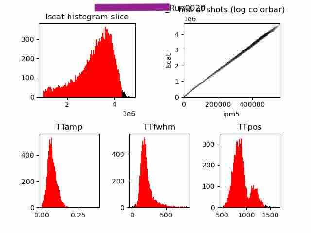
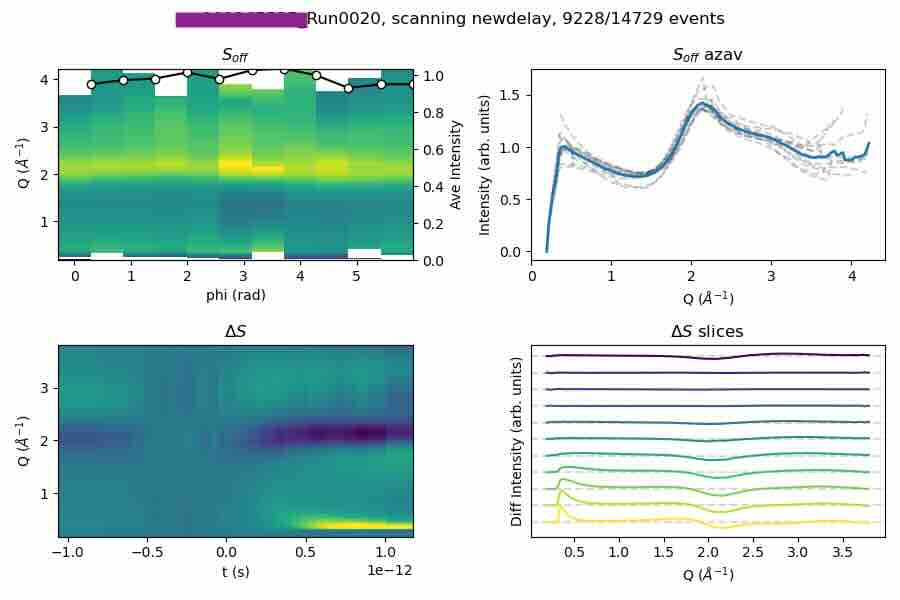

# Scattering Code Tutorial for Liquid Jet Experiments at XCS (LCLS)
## February 11, 2026
## Sumana Raj

# The Data
## 1.	 .xtc files:  
all the detector images and motors for each shot
## 2.	smalldata (.h5): 
processed detector images (pedestals, masks, gain corrections, etc) that is reduced further and select motors of interest.

- XES:  ROI(s) on detector are saved as image
- XAS:  ROI sum is saved 
- XSS:  azimuthally binned data is saved
  
## 3.	Edit smalldata production:
`/sdf/data/lcls/ds/xcs/[experiment]/results/smalldata_tools/lcls1_producers/prod_config_xcs.py`

- parameters for ROI selection and processing,  azimuthal integration, and other motors of interest 

- epicsOnce: saves the motor position once per run

- epicsPVs:  saves the motor position for every event

- 
# Setting up Jupyter Session:
## 1.	Soft link from experiment folder to your directory.  In a Jupyter terminal:
`ln -sf [source] [link]`

Example: 
		`ln -sf /sdf/data/lcls/ds/xcs/xcs101220125/results/ $HOME/xcs101220125_link`
        
- if you make a mistake you can unlink folder:
`unlink [link]`

## 2.	Pull ReduceScatt code from github: https://github.com/Solution-Phase-Chemistry/ReduceScatt

In a Jupyter terminal: 

`git clone git@github.com:Solution-Phase-Chemistry/ReduceScatt.git`

`cd ReduceScatt`

`git fetch origin`

`git checkout [desired branch]`
        

# What’s in ReduceScatt?
1.	Example notebooks for a delay (time) scan and an overlap (motor) scan
2.	Master notebook that has lots of cells to do lots of things but should not be run start to finish.
3.	StepByStep notebook that breaks down the reduce function
4.	paramDict_details file that goes into the details of what the parameters are and what kinds of inputs they accept
5.	LCLSDataToolsNew:  where all the python functions live

# Let’s process some data
## 1.	Set up:  
1. exper should equal the experiment you are working on currently
2. outpath:  where you want data to be saved, you can keep it as is or change it to wherever you like
3. if you uncomment the last few lines it will automatically make the needed output directories
 

## 2.	varDict:  
where in the smalldata to find the values of interest.  You probably won’t have to change this, but may have to adjust it at the beginning of a new experiment.  
## 3.	paramDict:  
see paramDict_details.md for more info. 

1. binSetup:  for time scans with the fast delay stage, this should not be ‘unique’ !!  There are too many unique values and you will have too many bins.  However, for other motor scans, this should usually be set to ‘unique’
2. in general:  during a beamtime start with corr_filter and slope_filter False (off), and ‘energy_corr’, nonLin_corr’ etc as None.  Then, as needed you can turn on filters and corrections or use them for refining analysis after a beamtime.  
## 4.	Run Reduction:  Filters and bins run according to parameters specified.  
1. filter parameter figure and result overview figure are saved in the figure directory
2. binned data and various parameters are saved in a npy directory as a dictionary 
    - can turn on options to save data as a .mat or .h5 file
# What are these figures?
## filter/reduction figure

1. Iscat is the total intensity on the scattering detector
2. These histograms show filters and diagnostics being used.  If the histograms look strange or inconsistent with previous runs, you may have to adjust filter parameters (some hardcoded in the function, some in the paramDict), or check that there isn’t something else wrong with the data. 
 
## Results overview figure

1. top two plots:  S_off:  total scattering for laser off shots,  averaged,  the two plots show the same data in different ways,  use these plots for diagnostic purposes
    - if the solvent ring position is not consistent across phi bins the detector center position should be adjusted
    - if there are spikes/odd behavior in some bins masking should be applied
        - can quickly mask in q/phi space in the ReduceData function
        - properly mask data in pixel space with SmallDataAna tools
2. bottom two plots:  dS:  azimuthally averaged difference signal vs q and time (or whatever the binned axis may be).  The bottom right plot is evenly spaced time slices of the 2D data.  
3. optional:  dS_0 and dS_2 plots:  if you are doing anisotropic decomposition in the reduction step (Aniso: True), then those values will be ploted as well, both as 2D data and as time slices
 

# Stacking Data
1.	Average data from runs that are measuring the same thing and have the same binned axis
2.	Not automatically saved

